# Analysis of the SOD results from the CPOM Flux Experiment - Summer 2014

## Purpose

This code it to analyze the SOD data from the treatments with and without CPOM and/or nutrients

## Import data

    sod10 <- read.table("./data/sod_calculation_10jun2014.csv", header = T, sep = ",")
    sod12 <- read.table("./data/sod_calculation_12jun2014.csv", header = T, sep = ",")
    sod17 <- read.table("./data/sod_calculation_17jun2014.csv", header = T, sep = ",")
    sod24 <- read.table("./data/sod_calculation_24jun2014.csv", header = T, sep = ",")
    sod01 <- read.table("./data/sod_calculation_1jul2014.csv", header = T, sep = ",")
    botOM <- read.table("./data/CPOM_flux_bottleOM_initial.csv", header = T, sep = ",")

## Data Analysis

## 10 June 2014 Run

### Merge sediment OM calculation to SOD

    sod10 <- merge(sod10, botOM, by.x = "CPOM", by.y = "CPOM")

### Normalize flux to sediment OM and time

    mmol.h10 <- sod10$dDO / sod10$incubation.h
    mmol.h.OM10 <- mmol.h10 / sod10$tot.OM
    ## convert to umol to make easier to read
    umol.h.OM10 <- mmol.h.OM10 * 1000

### Summarize OM normalized Data

    summary(umol.h.OM10)

~~~~

    summary(umol.h.OM10)
   Min. 1st Qu.  Median    Mean 3rd Qu.    Max. 
 0.3146  0.4674  0.5990  0.5849  0.6820  0.8830

~~~~

    stem(umol.h.OM10)

~~~~

The decimal point is 1 digit(s) to the left of the |

  2 | 16
  4 | 577946
  6 | 4578938
  8 | 8

~~~~

### Comparison of OM normalized SOD by treatments

    anova(lm(umol.h.OM10 ~ CPOM * nutrient, data = sod10))
    hist(residuals(lm(umol.h.OM10 ~ CPOM * nutrient, data = sod10)))

#### Output

~~~~

Analysis of Variance Table

Response: umol.h.OM10
              Df   Sum Sq  Mean Sq F value   Pr(>F)   
CPOM           1 0.125545 0.125545 10.4335 0.007218 **
nutrient       1 0.083208 0.083208  6.9151 0.021990 * 
CPOM:nutrient  1 0.007725 0.007725  0.6420 0.438580   
Residuals     12 0.144394 0.012033                    

~~~~

    plot(umol.h.OM10 ~ CPOM, data = sod10, ylab = expression(paste(mu, "mol h"^{-1}, "g OM"^{-1})), ylim = c(0, 2), col = "light green")
    dev.copy(png, "./output/plots/CPOM_flux_OMflux_by_CPOM_10jun2014.png")
    dev.off()

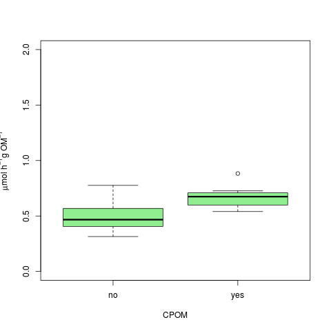

_SOD by CPOM_

    plot(umol.h.OM10  ~ nutrient, data = sod10, ylab = expression(paste(mu, "mol h"^{-1}, "g OM"^{-1})), ylim = c(0, 2), col = "orange")
    dev.copy(png, "./output/plots/CPOM_flux_OMflux_by_nutrient_10jun2014.png")
    dev.off()

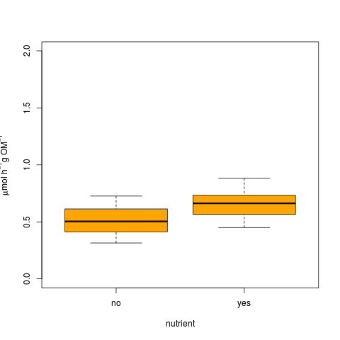

_SOD by nutrient_

### Comparison of Area normalized SOD by treatments

### Summarize Area Normalized Data

    summary(sod10$SOD)

~~~~

 Min. 1st Qu.  Median    Mean 3rd Qu.    Max. 
 0.3650  0.5424  0.7057  0.6878  0.8097  1.0480

~~~~

    stem(sod10$SOD)

~~~~

The decimal point is 1 digit(s) to the left of the |

   2 | 7
   4 | 22447
   6 | 4656
   8 | 01260
  10 | 5

~~~~

### Comparison of the Area Normalized SOD by Treatment

    anova(lm(SOD ~ CPOM * nutrient, data = sod10))
    hist(residuals(lm(SOD ~ CPOM * nutrient, data = sod10)))

#### Output

~~~~

Analysis of Variance Table

Response: SOD
              Df   Sum Sq  Mean Sq F value   Pr(>F)   
CPOM           1 0.200051 0.200051 12.1137 0.004542 **
nutrient       1 0.113854 0.113854  6.8942 0.022152 * 
CPOM:nutrient  1 0.009861 0.009861  0.5971 0.454638   
Residuals     12 0.198174 0.016515                    

~~~~

    plot(SOD ~ CPOM, data = sod10, ylab = expression(paste("mmol m"^{-2},"h"^{-1})), ylim = c(0, 3 ), col = "light green")
    dev.copy(png, "./output/plots/CPOM_flux_Aflux_by_CPOM_10jun2014.png")
    dev.off()

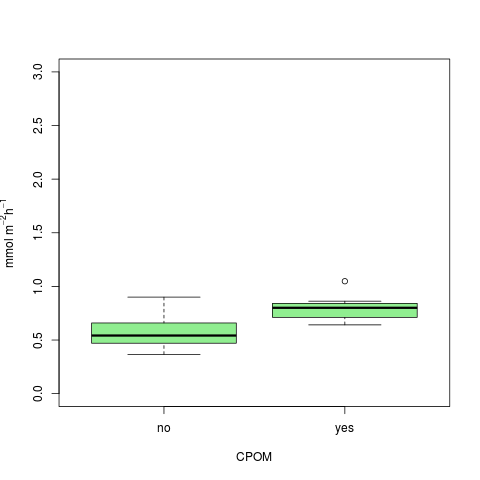

_Area SOD by CPOM_

    plot(SOD ~ nutrient, data = sod10, ylab = expression(paste("mmol m"^{-2},"h"^{-1})), ylim = c(0, 3 ), col = "orange")
    dev.copy(png, "./output/plots/CPOM_flux_Aflux_by_Nutrient_10jun2014.png")
    dev.off()

_Area SOD by Nutrient_

################################################################################

## 12 June 2014 Run

### Merge sediment OM calculation to SOD

    sod12 <- merge(sod12, botOM, by.x = "CPOM", by.y = "CPOM")

### Normalize flux to sediment OM and time

    mmol.h12 <- sod12$dDO / sod12$incubation.h
    mmol.h.OM12 <- mmol.h12 / sod12$tot.OM
    ## convert to umol to make easier to read
    umol.h.OM12 <- mmol.h.OM12 * 1000

### Summarize OM normalized Data

    summary(umol.h.OM12)

~~~~

    summary(umol.h.OM12)
   Min. 1st Qu.  Median    Mean 3rd Qu.    Max.    NAs 
 0.5834  0.9614  1.2040  1.1510  1.4020  1.6280  1.0000

~~~~

    stem(umol.h.OM12)

~~~~

The decimal point is at the |

  0 | 6699
  1 | 00122344
  1 | 566

~~~~

### Comparison of OM normalized SOD by treatments

    anova(lm(umol.h.OM12 ~ CPOM * nutrient, data = sod12))
    hist(residuals(lm(umol.h.OM12 ~ CPOM * nutrient, data = sod12)))

#### Output

~~~~

Analysis of Variance Table

Response: umol.h.OM12
              Df  Sum Sq  Mean Sq F value Pr(>F)
CPOM           1 0.24784 0.247841  2.5907 0.1358
nutrient       1 0.20361 0.203610  2.1283 0.1726
CPOM:nutrient  1 0.01282 0.012824  0.1340 0.7212
Residuals     11 1.05234 0.095667               

~~~~

    plot(umol.h.OM12 ~ CPOM, data = sod12, ylab = expression(paste(mu, "mol h"^{-1}, "g OM"^{-1})), ylim = c(0, 2), col = "light green")
    dev.copy(png, "./output/plots/CPOM_flux_OMflux_by_CPOM_12jun2014.png")
    dev.off()

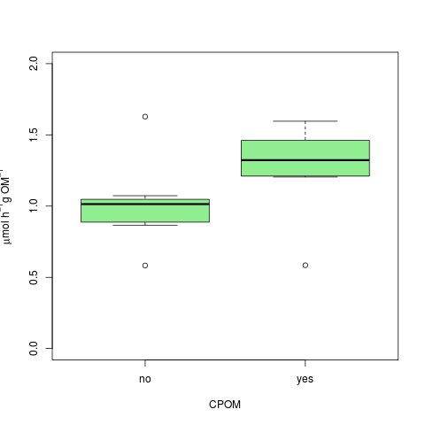

_SOD by CPOM_

    plot(umol.h.OM12  ~ nutrient, data = sod12, ylab = expression(paste(mu, "mol h"^{-1}, "g OM"^{-1})), ylim = c(0, 2), col = "orange")
    dev.copy(png, "./output/plots/CPOM_flux_OMflux_by_nutrient_12jun2014.png")
    dev.off()

_SOD by nutrient_

### Comparison of Area normalized SOD by treatments

### Summarize Area Normalized Data

    summary(sod12$SOD)

~~~~

    summary(sod12$SOD)
   Min. 1st Qu.  Median    Mean 3rd Qu.    Max.    NAs 
  0.677   1.116   1.430   1.354   1.664   1.895   1.000

~~~~

    stem(sod12$SOD)

~~~~

The decimal point is at the |

  0 | 77
  1 | 0122244
  1 | 567899

~~~~

### Comparison of the Area Normalized SOD by Treatment

    anova(lm(SOD ~ CPOM * nutrient, data = sod12))
    hist(residuals(lm(SOD ~ CPOM * nutrient, data = sod12)))

#### Output

~~~~

Analysis of Variance Table

Response: SOD
              Df  Sum Sq Mean Sq F value Pr(>F)
CPOM           1 0.41415 0.41415  3.1307 0.1045
nutrient       1 0.27944 0.27944  2.1124 0.1740
CPOM:nutrient  1 0.01607 0.01607  0.1215 0.7340
Residuals     11 1.45513 0.13228               

~~~~

    plot(SOD ~ CPOM, data = sod12, ylab = expression(paste("mmol m"^{-2},"h"^{-1})), ylim = c(0, 3 ), col = "light green")
    dev.copy(png, "./output/plots/CPOM_flux_Aflux_by_CPOM_12jun2014.png")
    dev.off()

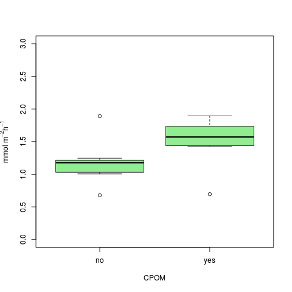

_Area SOD by CPOM_

    plot(SOD ~ nutrient, data = sod12, ylab = expression(paste("mmol m"^{-2},"h"^{-1})), ylim = c(0, 3 ), col = "orange")
    dev.copy(png, "./output/plots/CPOM_flux_Aflux_by_Nutrient_12jun2014.png")
    dev.off()

_Area SOD by Nutrient_

################################################################################

## 17 June 2014 Run

### Merge sediment OM calculation to SOD

    sod17 <- merge(sod17, botOM, by.x = "CPOM", by.y = "CPOM")

### Normalize flux to sediment OM and time

    mmol.h17 <- sod17$dDO / sod17$incubation.h
    mmol.h.OM17 <- mmol.h17 / sod17$tot.OM
    ## convert to umol to make easier to read
    umol.h.OM17 <- mmol.h.OM17 * 1000

### Summarize OM normalized Data

    summary(umol.h.OM17)

~~~~

> summary(umol.h.OM17)
   Min. 1st Qu.  Median    Mean 3rd Qu.    Max. 
 0.5506  0.7920  1.0170  1.0730  1.3170  1.7670 

~~~~

    stem(umol.h.OM17)

~~~~

  The decimal point is at the |

  0 | 67788899
  1 | 123344
  1 | 58

~~~~

### Comparison of OM normalized SOD by treatments

    anova(lm(umol.h.OM17 ~ CPOM * nutrient, data = sod17))
    hist(residuals(lm(umol.h.OM17 ~ CPOM * nutrient, data = sod17)))

#### Output

~~~~

Analysis of Variance Table

Response: umol.h.OM17
              Df  Sum Sq Mean Sq F value    Pr(>F)    
CPOM           1 1.35752 1.35752 62.4730 4.254e-06 ***
nutrient       1 0.11794 0.11794  5.4275   0.03809 *  
CPOM:nutrient  1 0.03282 0.03282  1.5102   0.24267    
Residuals     12 0.26076 0.02173

~~~~

    plot(umol.h.OM17 ~ CPOM, data = sod17, ylab = expression(paste(mu, "mol h"^{-1}, "g OM"^{-1})), ylim = c(0, 2), col = "light green")
    dev.copy(png, "./output/plots/CPOM_flux_OMflux_by_CPOM_17jun2014.png")
    dev.off()

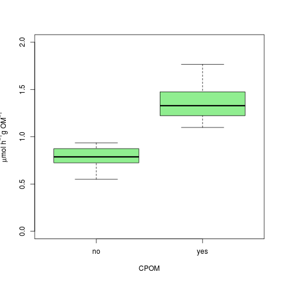

_SOD by CPOM_

    plot(umol.h.OM17  ~ nutrient, data = sod17, ylab = expression(paste(mu, "mol h"^{-1}, "g OM"^{-1})), ylim = c(0, 2), col = "orange")
    dev.copy(png, "./output/plots/CPOM_flux_OMflux_by_nutrient_17jun2014.png")
    dev.off()

_SOD by nutrient_

### Comparison of Area normalized SOD by treatments

### Summarize Area Normalized Data

    summary(sod17$SOD)

~~~~

    summary(sod17$SOD)
   Min. 1st Qu.  Median    Mean 3rd Qu.    Max. 
 0.6389  0.9190  1.1950  1.2640  1.5630  2.0980

~~~~

    stem(sod17$SOD)

~~~~

  The decimal point is at the |

  0 | 68999
  1 | 01134
  1 | 55678
  2 | 1

~~~~

### Comparison of the Area Normalized SOD by Treatment

    anova(lm(SOD ~ CPOM * nutrient, data = sod17))
    hist(residuals(lm(SOD ~ CPOM * nutrient, data = sod17)))

#### Output

~~~~

Analysis of Variance Table

Response: SOD 17jun2014
              Df  Sum Sq Mean Sq F value    Pr(>F)    
CPOM           1 2.03121 2.03121 67.3700 2.888e-06 ***
nutrient       1 0.16447 0.16447  5.4550   0.03769 *  
CPOM:nutrient  1 0.04719 0.04719  1.5653   0.23473    
Residuals     12 0.36180 0.03015                      

~~~~

    plot(SOD ~ CPOM, data = sod17, ylab = expression(paste("mmol m"^{-2},"h"^{-1})), ylim = c(0, 3 ), col = "light green")
    dev.copy(png, "./output/plots/CPOM_flux_Aflux_by_CPOM_17jun2014.png")
    dev.off()

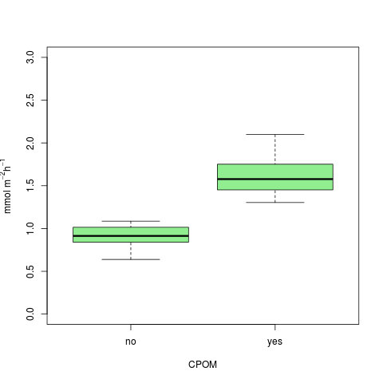

_Area SOD by CPOM_

    plot(SOD ~ nutrient, data = sod17, ylab = expression(paste("mmol m"^{-2},"h"^{-1})), ylim = c(0, 3 ), col = "orange")
    dev.copy(png, "./output/plots/CPOM_flux_Aflux_by_Nutrient_17jun2014.png")
    dev.off()

_Area SOD by

################################################################################

## 24 June 2014 Run

### Merge sediment OM calculation to SOD

    sod24 <- merge(sod24, botOM, by.x = "CPOM", by.y = "CPOM")

### Normalize flux to sediment OM and time

    mmol.h24 <- sod24$dDO / sod24$incubation.h
    mmol.h.OM24 <- mmol.h24 / sod24$tot.OM
    ## convert to umol to make easier to read
    umol.h.OM24 <- mmol.h.OM24 * 1000

### Summarize OM normalized Data

    summary(umol.h.OM24)

~~~~

summary(umol.h.OM24)
   Min. 1st Qu.  Median    Mean 3rd Qu.    Max. 
 0.5005  0.6838  0.7706  0.7959  0.8950  1.1900

~~~~

    stem(umol.h.OM24)

~~~~

The decimal point is 1 digit(s) to the left of the |

   4 | 09
   6 | 4400359
   8 | 2376
  10 | 019

~~~~

### Comparison of OM normalized SOD by treatments

    anova(lm(umol.h.OM24 ~ CPOM * nutrient, data = sod24))
    hist(residuals(lm(umol.h.OM24 ~ CPOM * nutrient, data = sod24)))

#### Output

~~~~

Analysis of Variance Table

Response: umol.h.OM24
              Df   Sum Sq  Mean Sq F value   Pr(>F)   
CPOM           1 0.274476 0.274476 16.8844 0.001449 **
nutrient       1 0.000916 0.000916  0.0564 0.816332   
CPOM:nutrient  1 0.006916 0.006916  0.4255 0.526521   
Residuals     12 0.195074 0.016256                    

~~~~

    plot(umol.h.OM24 ~ CPOM, data = sod24, ylab = expression(paste(mu, "mol h"^{-1}, "g OM"^{-1})), ylim = c(0, 2), col = "light green")
    dev.copy(png, "./output/plots/CPOM_flux_OMflux_by_CPOM_24jun2014.png")
    dev.off()

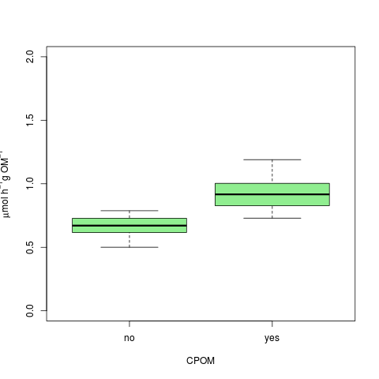

_SOD by CPOM_

    plot(umol.h.OM24  ~ nutrient, data = sod24, ylab = expression(paste(mu, "mol h"^{-1}, "g OM"^{-1})), ylim = c(0, 2), col = "orange")
    dev.copy(png, "./output/plots/CPOM_flux_OMflux_by_nutrient_24jun2014.png")
    dev.off()

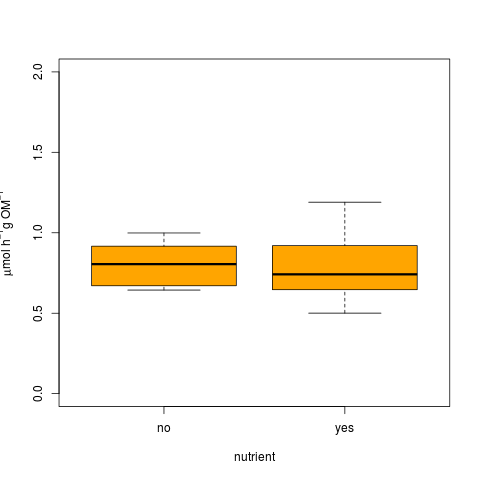

_SOD by nutrient_

### Comparison of Area normalized SOD by treatments

### Summarize Area Normalized Data

    summary(sod24$SOD)

~~~~

summary(sod24$SOD)
   Min. 1st Qu.  Median    Mean 3rd Qu.    Max. 
 0.5808  0.7935  0.8942  0.9360  1.0630  1.4130 

~~~~

    stem(sod24$SOD)

~~~~

The decimal point is 1 digit(s) to the left of the |

   4 | 8
   6 | 855
   8 | 1277189
  10 | 449
  12 | 0
  14 | 1

~~~~

### Comparison of the Area Normalized SOD by Treatment

    anova(lm(SOD ~ CPOM * nutrient, data = sod24))
    hist(residuals(lm(SOD ~ CPOM * nutrient, data = sod24)))

#### Output

~~~~

Analysis of Variance Table

Response: SOD
              Df  Sum Sq Mean Sq F value    Pr(>F)    
CPOM           1 0.43249 0.43249 19.1057 0.0009106 ***
nutrient       1 0.00118 0.00118  0.0523 0.8229020    
CPOM:nutrient  1 0.00945 0.00945  0.4175 0.5303481    
Residuals     12 0.27164 0.02264                      

~~~~

    plot(SOD ~ CPOM, data = sod24, ylab = expression(paste("mmol m"^{-2},"h"^{-1})), ylim = c(0, 3 ), col = "light green")
    dev.copy(png, "./output/plots/CPOM_flux_Aflux_by_CPOM_24jun2014.png")
    dev.off()

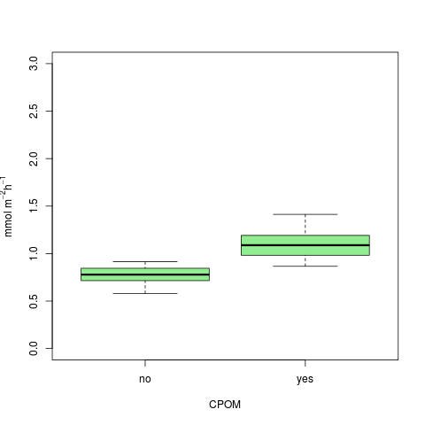

_Area SOD by CPOM_

    plot(SOD ~ nutrient, data = sod24, ylab = expression(paste("mmol m"^{-2},"h"^{-1})), ylim = c(0, 3 ), col = "orange")
    dev.copy(png, "./output/plots/CPOM_flux_Aflux_by_Nutrient_24jun2014.png")
    dev.off()

_Area SOD by Nutrient_

################################################################################

## 1 July 2014 Run

### Merge sediment OM calculation to SOD

    sod01 <- merge(sod01, botOM, by.x = "CPOM", by.y = "CPOM")

### Normalize flux to sediment OM and time

    mmol.h01 <- sod01$dDO / sod01$incubation.h
    mmol.h.OM01 <- mmol.h01 / sod01$tot.OM
    ## convert to umol to make easier to read
    umol.h.OM01 <- mmol.h.OM01 * 1000

### Summarize OM normalized Data

    summary(umol.h.OM01)

~~~~

    summary(umol.h.OM01)
   Min. 1st Qu.  Median    Mean 3rd Qu.    Max. 
 0.3074  0.6258  0.7648  0.7490  0.8067  1.2120

~~~~

    stem(umol.h.OM01)

~~~~

The decimal point is 1 digit(s) to the left of the |

   2 | 1
   4 | 17
   6 | 04835899
   8 | 046
  10 | 3
  12 | 1

~~~~

### Comparison of OM normalized SOD by treatments

    anova(lm(umol.h.OM01 ~ CPOM * nutrient, data = sod01))
    hist(residuals(lm(umol.h.OM01 ~ CPOM * nutrient, data = sod01)))

#### Output

~~~~

Analysis of Variance Table

Response: umol.h.OM01
              Df  Sum Sq  Mean Sq F value  Pr(>F)  
CPOM           1 0.01561 0.015612  0.3938 0.54204  
nutrient       1 0.17111 0.171108  4.3166 0.05987 .
CPOM:nutrient  1 0.05089 0.050889  1.2838 0.27933  
Residuals     12 0.47568 0.039640

~~~~

    plot(umol.h.OM01 ~ CPOM, data = sod01, ylab = expression(paste(mu, "mol h"^{-1}, "g OM"^{-1})), ylim = c(0, 2), col = "light green")
    dev.copy(png, "./output/plots/CPOM_flux_OMflux_by_CPOM_1jul2014.png")
    dev.off()

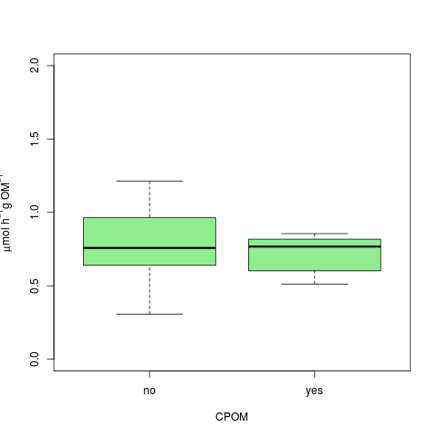

_SOD by CPOM_

    plot(umol.h.OM01  ~ nutrient, data = sod01, ylab = expression(paste(mu, "mol h"^{-1}, "g OM"^{-1})), ylim = c(0, 2), col = "orange")
    dev.copy(png, "./output/plots/CPOM_flux_OMflux_by_nutrient_1jul2014.png")
    dev.off()

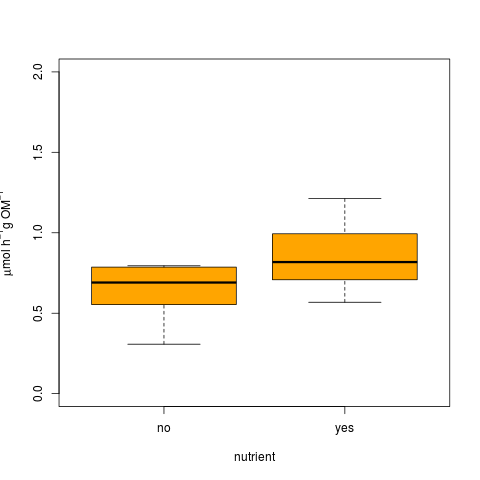

_SOD by nutrient_

### Comparison of Area normalized SOD by treatments

### Summarize Area Normalized Data

    summary(sod01$SOD)

~~~~

   Min. 1st Qu.  Median    Mean 3rd Qu.    Max. 
 0.3567  0.7389  0.8974  0.8788  0.9565  1.4070

~~~~

    stem(sod01$SOD)

~~~~

The decimal point is at the |

  0 | 4
  0 | 67788899999
  1 | 0034

~~~~

### Comparison of the Area Normalized SOD by Treatment

    anova(lm(SOD ~ CPOM * nutrient, data = sod01))
    hist(residuals(lm(SOD ~ CPOM * nutrient, data = sod01)))

#### Output

~~~~

Analysis of Variance Table

Response: SOD
              Df  Sum Sq  Mean Sq F value  Pr(>F)  
CPOM           1 0.01135 0.011346  0.2105 0.65459  
nutrient       1 0.23284 0.232839  4.3197 0.05979 .
CPOM:nutrient  1 0.06721 0.067214  1.2470 0.28599  
Residuals     12 0.64682 0.053902                  

~~~~

    plot(SOD ~ CPOM, data = sod01, ylab = expression(paste("mmol m"^{-2},"h"^{-1})), ylim = c(0, 3 ), col = "light green")
    dev.copy(png, "./output/plots/CPOM_flux_Aflux_by_CPOM_1jul2014.png")
    dev.off()

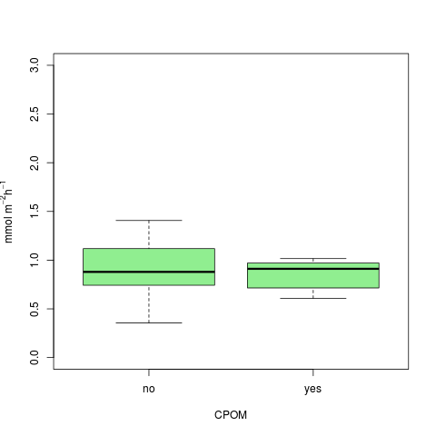

_Area SOD by CPOM_

    plot(SOD ~ nutrient, data = sod01, ylab = expression(paste("mmol m"^{-2},"h"^{-1})), ylim = c(0, 3 ), col = "orange")
    dev.copy(png, "./output/plots/CPOM_flux_Aflux_by_Nutrient_1jul2014.png")
    dev.off()

_Area SOD by Nutrient_

################################################################################

## Combine All Dates

### Average OM normalized SOD

    sum.OMflux <- umol.h.OM10 + umol.h.OM12 + umol.h.OM17 + umol.h.OM24 + umol.h.OM01
    mean.OMflux <- sum.OMflux / 5

### Summarize Mean OM Normalized Data

### Compare mean OM normalized SOD by treatment

    anova(lm(mean.OMflux ~ CPOM * nutrient, data = sod17))
    hist(residuals(lm(SOD ~ CPOM * nutrient, data = sod17)))

#### Output

~~~~

Analysis of Variance Table

Response: mean.OMflux
              Df   Sum Sq  Mean Sq F value    Pr(>F)    
CPOM           1 0.218545 0.218545 22.5504 0.0006009 ***
nutrient       1 0.076169 0.076169  7.8595 0.0171677 *  
CPOM:nutrient  1 0.002819 0.002819  0.2909 0.6003812    
Residuals     11 0.106605 0.009691                      
~~~~

    plot(mean.OMflux ~ CPOM, data = sod17, ylab = expression(paste("mmol m"^{-2},"h"^{-1})), ylim = c(0, 3 ), col = "light green")
    dev.copy(png, "./output/plots/CPOM_flux_OMflux_by_CPOM_all.png")
    dev.off()

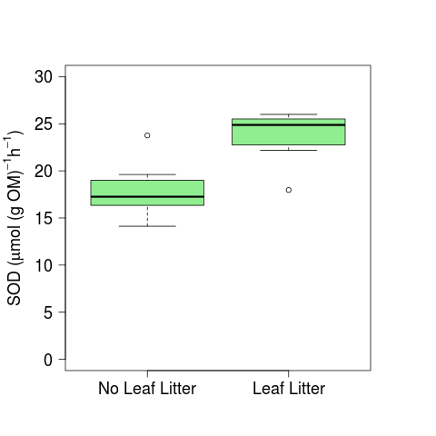

_OM SOD by CPOM_

    plot(mean.OMflux ~ nutrient, data = sod17, ylab = expression(paste("mmol m"^{-2},"h"^{-1})), ylim = c(0, 3 ), col = "orange")
    dev.copy(png, "./output/plots/CPOM_flux_OMflux_by_Nutrient_all.png")
    dev.off()

_OM SOD by Nutrient_

### Average OM normalized SOD

    sum.Aflux <- sod10$SOD + sod12$SOD + sod17$SOD + sod24$SOD + sod01$SOD
    mean.Aflux <- sum.Aflux / 5

### Summarize Mean OM Normalized Data

### Compare mean Area normalized SOD by treatment

    anova(lm(mean.Aflux ~ CPOM * nutrient, data = sod17))
    hist(residuals(lm(SOD ~ CPOM * nutrient, data = sod17)))

#### Output

~~~~

Analysis of Variance Table

Response: mean.Aflux
              Df  Sum Sq Mean Sq F value    Pr(>F)    
CPOM           1 0.35260 0.35260 26.3390 0.0003272 ***
nutrient       1 0.10468 0.10468  7.8193 0.0173894 *  
CPOM:nutrient  1 0.00343 0.00343  0.2564 0.6226079    
Residuals     11 0.14726 0.01339

~~~~

    plot(mean.Aflux ~ CPOM, data = sod17, ylab = expression(paste("mmol m"^{-2},"h"^{-1})), ylim = c(0, 3 ), col = "light green")
    dev.copy(png, "./output/plots/CPOM_flux_Aflux_by_CPOM_all.png")
    dev.off()

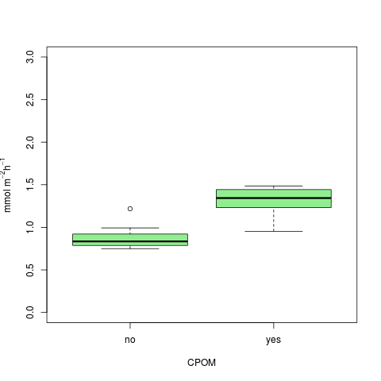

_Area SOD by CPOM_

    par(mar = c(3, 5, 3, 3))
    plot((mean.OMflux * 24) ~ CPOM, data = sod17, ylab = expression(paste("SOD (", mu,"mol (g OM)"^{-1},"h"^{-1}, ")")), ylim = c(0, 30), col = "light green", axes = F, xlab = " ", cex.lab = 1.2)
    axis(1, at = c(1, 2), labels = c("No Leaf Litter", "Leaf Litter"), cex.axis = 1.2)
    axis(2, las = 2, cex.axis = 1.5)
    box()
    dev.copy(png, "./output/plots/CPOM_flux_OMflux_by_CPOM_all.png")
    dev.off()
    dev.copy(pdf, "./output/plots/CPOM_flux_OMflux_by_CPOM_all.pdf")
    dev.off()

_OM Normalized SOD by CPOM_

    par(mar = c(3, 5, 3, 3))
    plot((mean.OMflux * 24) ~ nutrient, data = sod17, ylab = expression(paste("SOD (", mu,"mol (g OM)"^{-1},"h"^{-1}, ")")), ylim = c(0, 30), col = "orange", axes = F, xlab = " ", cex.lab = 1.5)
    axis(1, at = c(1, 2), labels = c("Ambient Nutrients", "Enriched Nutrients"), cex.axis = 1.2)
    axis(2, las = 2, cex.axis = 1.5)
    box()
    dev.copy(png, "./output/plots/CPOM_flux_OMflux_by_nutrient_all.png")
    dev.off()
    dev.copy(pdf, "./output/plots/CPOM_flux_OMflux_by_nutrient_all.pdf")
    dev.off()

_OM Normalized SOD by Nutrient_

### Areal SOD by Time

#### Bind all dates

    sod.tot <- rbind(sod10, sod12, sod17, sod24, sod01)
    date <- c(rep("2014-06-10", 16), rep("2014-06-12", 16), rep("2014-06-17", 16), rep("2014-06-24", 16), rep("2014-07-01", 16))
    sod.tot <- data.frame(date, sod.tot)

#### Determine days elapsed

    days10 <- as.numeric(difftime(sod.tot$date[sod.tot$date == "2014-06-10"], sod.tot$date[sod.tot$date == "2014-06-10"], units = "days"))
    days12 <- as.numeric(difftime(sod.tot$date[sod.tot$date == "2014-06-12"], sod.tot$date[sod.tot$date == "2014-06-10"], units = "days"))
    days17 <- as.numeric(difftime(sod.tot$date[sod.tot$date == "2014-06-17"], sod.tot$date[sod.tot$date == "2014-06-10"], units = "days"))
    days24 <- as.numeric(difftime(sod.tot$date[sod.tot$date == "2014-06-24"], sod.tot$date[sod.tot$date == "2014-06-10"], units = "days"))
    days01 <- as.numeric(difftime(sod.tot$date[sod.tot$date == "2014-07-01"], sod.tot$date[sod.tot$date == "2014-06-10"], units = "days"))
    days.elap <- c(days10, days12, days17, days24, days01)

    sod.tot <- data.frame(sod.tot, days.elap)

##### Output

    unique(days.elap)
   
    > unique(days.elap)
    [1]  0  2  7 14 21
#### Analyize areal normalized by time

    par(mar = c(5, 5, 5, 5))
    plot((SOD * 24) ~ days.elap, data = sod.tot, subset = CPOM == "yes", pch = 19, ylim = c(0, 60), ylab = expression(paste("SOD (mmol m"^{-2}, "d"^{-1}, ")")), xlab = "Experiment Days", cex.lab = 1.5, axes = F, cex = 1.5, col = "brown")
    axis(1, las = 1, cex = 1.5)
    axis(2, las = 2, cex = 1.5)
    points((SOD * 24) ~ days.elap, data = sod.tot, subset = CPOM == "no", pch = 8, cex = 1.5, col = "blue")
    legend(10, 60, c("CPOM", "NO-CPOM"), pch = c(19, 8), col = c("brown", "blue"), cex = 1.5)
    dev.copy(png, "./output/plots/CPOM_flux_Aflux_by_date.png")
    dev.off()
    dev.copy(pdf, "./output/plots/CPOM_flux_Aflux_by_date.pdf")
    dev.off()

_Areal SOD by Date with CPOM_

    par(mar = c(5, 5, 5, 5))
    plot((SOD * 24) ~ days.elap, data = sod.tot, subset = nutrient == "yes", pch = 17, ylim = c(0, 60), ylab = expression(paste("SOD (mmol m"^{-2}, "d"^{-1}, ")")), xlab = "Experiment Days", cex.lab = 1.5, axes = F, cex = 1.5, col = "brown")
    axis(1, las = 1, cex = 1.5)
    axis(2, las = 2, cex = 1.5)
    points((SOD * 24) ~ days.elap, data = sod.tot, subset = nutrient == "no", pch = 8, cex = 1.5, col = "blue")
    legend(10, 60, c("Enriched Nutrients", "Ambient Nutrients"), pch = c(19, 8), col = c("brown", "blue"), cex = 1.5)
    dev.copy(png, "./output/plots/nutrient_flux_Aflux_by_date.png")
    dev.off()
    dev.copy(pdf, "./output/plots/nutrient_flux_Aflux_by_date.pdf")
    dev.off()

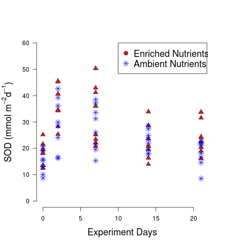

_Areal SOD by Date with Nutrients_

#### Analyize OM normalized SOD by time

##### create OM normalized variable

    sod.OM.bot <- sod.tot$dDO/sod.tot$tot.OM
    sod.OM.h <- sod.OM.bot/sod.tot$incubation.h
    sod.OM.mmol <- sod.OM.h * 24
    sod.OM <- sod.OM.mmol * 1000 # flux in umol O2 / g OM / d

    par(mar = c(5, 5, 5, 5))
    plot(sod.OM ~ days.elap, data = sod.tot, subset = CPOM == "yes", pch = 19, ylim = c(0, 50), ylab = expression(paste("SOD (", mu,"mol (g OM)"^{-1}, "d"^{-1}, ")")), xlab = "Experiment Days", cex.lab = 1.5, axes = F, cex = 1.5, col = "light green")
    points(sod.OM ~ days.elap, data = sod.tot, subset = CPOM == "yes", pch = 1, cex = 1.5)
    axis(1, las = 1, cex = 1.5)
    axis(2, las = 2, cex = 1.5)
    points(sod.OM ~ days.elap, data = sod.tot, subset = CPOM == "no", pch = 8, cex = 1.5, col = "blue")
    legend(8, 50, c("Leaf Litter ", "No-Leaf Litter "), pch = c(19, 8), col = c("light green", "blue"), cex = 1.5)
    legend(8, 50, c("Leaf Litter ", "No-Leaf Litter "), pch = c(1, 8), col = c("black", "blue"), cex = 1.5)
    dev.copy(png, "./output/plots/CPOM_flux_OMflux_by_date.png")
    dev.off()
    dev.copy(pdf, "./output/plots/CPOM_flux_OMflux_by_date.pdf")
    dev.off()

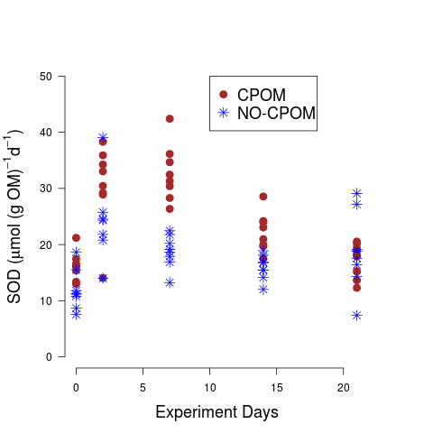

_OM normalized SOD by Date_

    par(mar = c(5, 5, 5, 5))
    plot(sod.OM ~ days.elap, data = sod.tot, subset = nutrient == "yes", pch = 19, ylim = c(0, 50), ylab = expression(paste("SOD (", mu,"mol (g OM)"^{-1}, "d"^{-1}, ")")), xlab = "Experiment Days", cex.lab = 1.5, axes = F, cex = 1.5, col = "orange")
    points(sod.OM ~ days.elap, data = sod.tot, subset = nutrient == "yes", pch = 1, cex = 1.5)
    axis(1, las = 1, cex = 1.5)
    axis(2, las = 2, cex = 1.5)
    points(sod.OM ~ days.elap, data = sod.tot, subset = nutrient == "no", pch = 8, cex = 1.5, col = "blue")
    legend(8, 50, c("Enriched Nutrients ", "Ambient Nutrients "), pch = c(19, 8), col = c("orange", "blue"), cex = 1.5)
    legend(8, 50, c("Enriched Nutrients ", "Ambient Nutrients "), pch = c(1, 8), col = c("black", "blue"), cex = 1.5)
    dev.copy(png, "./output/plots/nutrient_flux_OMflux_by_date.png")
    dev.off()
    dev.copy(pdf, "./output/plots/nutrient_flux_OMflux_by_date.pdf")
    dev.off()

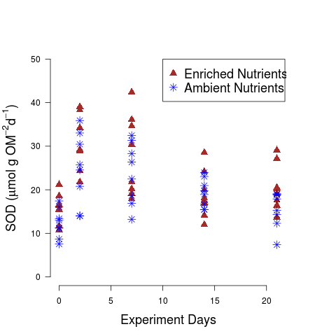

_OM SOD by Date with Nutrients_
