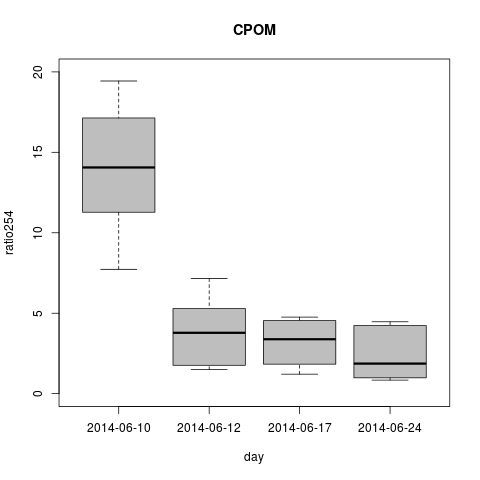

# Analysis of the spec scan results from the CPOM Flux Experiment - Summer 2014

## Purpose

This code it to analyze the spec scan data from the treatments with and without CPOM and/or nutrients

## Import data

    spec10 <- read.table("./data/cpom_flux_spec_10jun2014.csv", header = T, sep = ",")
    spec12 <- read.table("./data/cpom_flux_spec_12jun2014.csv", header = T, sep = ",")
    spec17 <- read.table("./data/cpom_flux_spec_17jun2014.csv", header = T, sep = ",")
    spec24 <- read.table("./data/cpom_flux_spec_24jun2014.csv", header = T, sep = ",")
    spec01 <- read.table("./data/cpom_flux_spec_1jul2014.csv", header = T, sep = ",")
    sod10 <- read.table("./data/cpom_flux_sod_10jun2014.csv", header = T, sep = ",") # imported to get treatment assignments to bod IDs
## Combine dates

    spec.all <- rbind(spec10, spec12, spec17, spec24, spec01)
    ## make date list
    day <- c(rep("2014-06-10", length(spec10$bod)), rep("2014-06-12", length(spec12$bod)), rep("2014-06-17", length(spec17$bod)), rep("2014-06-24", length(spec24$bod)), rep("2014-07-01", length(spec01$bod)))
    spec.tot <- data.frame(day, spec.all)

### Merge with treatments

    treat <- sod10[, c(1, 4, 5)] # selects for the relevant colums from the sod data.frame
    spec <- merge(treat, spec.tot, by.x = "bod", by.y = "bod")

## Data Analysis

### Calculate 254:365

    ratio254.abs <- spec$abs[spec$wl == 254] / spec$abs[spec$wl == 365]
    bod254 <- spec$bod[spec$wl == 254]
    CPOM254 <- spec$CPOM[spec$wl == 254]
    Nutrient254 <- spec$Nutrient[spec$wl == 254]
    day254 <- spec$day[spec$wl == 254]
    ratio254 <- data.frame(bod254, day254, CPOM254, Nutrient254, ratio254.abs)
    names(ratio254) <- c("bod", "day", "CPOM", "nutrient", "ratio254")

    elapsed10 <- as.numeric(difftime(ratio254$day[ratio254$day == "2014-06-10"], ratio254$day[ratio254$day == "2014-06-10"], units = "days"))
    elapsed12 <- as.numeric(difftime(ratio254$day[ratio254$day == "2014-06-12"], ratio254$day[ratio254$day == "2014-06-10"], units = "days"))
    elapsed17 <- as.numeric(difftime(ratio254$day[ratio254$day == "2014-06-17"], ratio254$day[ratio254$day == "2014-06-10"], units = "days"))
    elapsed24 <- as.numeric(difftime(ratio254$day[ratio254$day == "2014-06-24"], ratio254$day[ratio254$day == "2014-06-10"], units = "days"))
    elapsed01 <- as.numeric(difftime(ratio254$day[ratio254$day == "2014-07-01"], ratio254$day[ratio254$day == "2014-06-10"], units = "days"))
    elapsed.d <- c(elapsed10, elapsed12, elapsed17, elapsed24, elapsed01)

#### Make Data Frame of ratio254 with elapsed time

    # the order stmnt is to sort ratio254 so that it matches the sort of elapsed.d
    r254.t <- data.frame(ratio254[order(as.Date(ratio254$day)), ], elapsed.d)

#### Graphical Analysis

    par(mfcol = c(1, 4), mar = c(3, 4, 4, 1))
    plot(ratio254 ~ day, data = r254.t, subset = CPOM == "yes" & nutrient == "yes", ylim = c(0, 20), col = "dark red", axes = F, xlab = " ", ylab = "Proxy for Labile Dissolved Organic Matter (abs254:abs365)")
    axis(1, at = c(1, 2, 3, 4, 5), labels = c("10-Jun", "12-Jun", "17-Jun", "24-Jun", "1-Jul"))
    axis(2,  las = 2)
    text(3, 20, "Leaf + Enriched")
    plot(ratio254 ~ day, data = r254.t, subset = CPOM == "yes" & nutrient == "no", ylim = c(0, 20), col = "dark red", axes = F, xlab = " ", ylab = " ")
    axis(1, at = c(1, 2, 3, 4, 5), labels = c("10-Jun", "12-Jun", "17-Jun", "24-Jun", "1-Jul"))
#    axis(2,  las = 2)
    text(3, 20, "Leaf + Ambient")
    plot(ratio254 ~ day, data = r254.t, subset = CPOM == "no" & nutrient == "yes", ylim = c(0, 20), col = "dark red", axes = F, xlab = " ", ylab = " ")
    axis(1, at = c(1, 2, 3, 4, 5), labels = c("10-Jun", "12-Jun", "17-Jun", "24-Jun", "1-Jul"))
 #   axis(2,  las = 2)
    text(3, 20, "No-Leaf + Enriched")
    plot(ratio254 ~ day, data = r254.t, subset = CPOM == "no" & nutrient == "no", ylim = c(0, 20), col = "dark red", axes = F, xlab = " ", ylab = " ")
    axis(1, at = c(1, 2, 3, 4, 5), labels = c("10-Jun", "12-Jun", "17-Jun", "24-Jun", "1-Jul"))
  #  axis(2,  las = 2)
    text(3, 20, "No-Leaf + Ambient")

    par(mfcol = c(1, 2), mar = c(3, 4, 4, 0))
    plot(ratio254 ~ day, data = r254.t, subset = CPOM == "yes", ylim = c(0, 20), col = "light green", axes = F, xlab = " ", ylab = "Labile Dissolved Organic Matter (abs254:abs365)")
    axis(1, at = c(1, 2, 3, 4, 5), labels = c("10-Jun", "12-Jun", "17-Jun", "24-Jun", "1-Jul"))
    axis(2,  las = 2)
    text(3, 0, "Leaf Litter")
    par(mar = c(3, 0, 4, 4))
    plot(ratio254 ~ day, data = r254.t, subset = CPOM == "no", ylim = c(0, 20), col = 8, axes = F, xlab = " ", ylab = " ")
    axis(1, at = c(1, 2, 3, 4, 5), labels = c("10-Jun", "12-Jun", "17-Jun", "24-Jun", "1-Jul"))
#    axis(2,  las = 2)
    text(3, 0, "No-Leaf Litter")
    dev.copy(png, "./output/plots/cpom_flux_ratio254_by_day_CPOM.png")
    dev.off()

_ratio254 by day with CPOM_

    plot(ratio254 ~ day, data = ratio254, subset = CPOM == "no", ylim = c(0, 20), main = "NO-CPOM", col = 8)
    dev.copy(png, "./output/plots/cpom_flux_ratio254_by_day_noCPOM.png")
    dev.off()

_ratio254 by day with no CPOM_
    
    interaction.plot(ratio254$day, ratio254$CPOM, ratio254$ratio254, fun = "mean", xlab = "day", ylab = "ratio of absorbance at 254 to 365 nm", trace.label = "CPOM")
    dev.copy(png, "./output/plots/cpom_flux_ratio254_by_day_interaction.png")
    dev.off()

_ratio254 interaction between CPOM and day_

### Calculate S275-295

    spec.s275 <- spec[spec$wl >= 275 & spec$wl <= 295, ]

    max.s275 <- as.numeric(tapply(spec.s275$abs, list(spec.s275$bod, spec.s275$day), max))
    min.s275 <- as.numeric(tapply(spec.s275$abs, list(spec.s275$bod, spec.s275$day), min))
    rise <- max.s275 - min.s275
    run <- 295 - 275
    s275 <- rise / run

