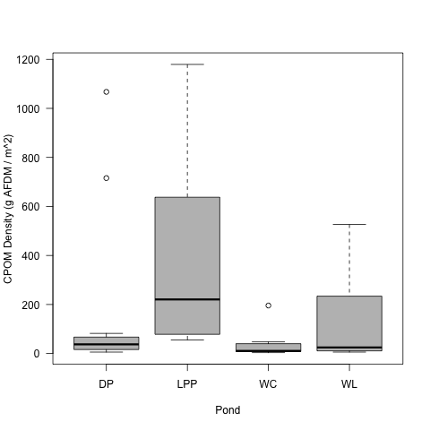

# Analysis of the CPOM Survey Data

Metadata can be found at:
  https://github.com/KennyPeanuts/pond_diversity_fcn/blob/master/lab_notebook_entries/data_analysis/code/CPOM_survey_2013_metadata.md

## Import Data

### Working Directory

    /Volumes/NO NAME/working_files/current_research/pond_diversity_fcn/lab_notebook_entries/data_analysis

### Import

    survey <- read.delim("./data/CPOM_survey_2013_calc.txt", header = T, stringsAsFactors = F)

## Data Analysis

### Research Questions

1) What is the density of CPOM in the study ponds?

2) How does the density of CPOM vary among ponds?

3) How does the density of CPOM vary within ponds?
     a. Littoral vs Open Habitats
     b. Within Littoral and Open Habitats

4) Does the density of CPOM vary with date (WL only)?

5) Is there a relationship between CPOM and percent OM in the sediments?

### Analysis

#### Density of CPOM in all samples

    summary(survey$CPOM.AFDM)

~~~~

    Min.  1st Qu.   Median     Mean  3rd Qu.     Max.     NAs 
0.001739 0.005461 0.020350 0.082150 0.092450 0.597000       12

~~~~

    par(las = 1)
    boxplot(survey$CPOM.AFDM, ylab = "CPOM Density (g AFDM/m^2)", col = 8)
    dev.copy(png, "./output/plots/CPOM_Dens_Boxplot.png")
    dev.off()

    par(las = 1)
    hist(survey$CPOM.AFDM, breaks = 10, xlab = "CPOM Density (g AFDM/m^2)", main = " ", col = 8)
    dev.copy(png, "./output/plots/CPOM_Dens_Hist.png")
    dev.off()

The data show that for all of the samples the density of CPOM is mainly under 100 mg AFDM / m^2 however there are local patches of higher CPOM with densities between 200 and 600 mg AFDM / m^2.

This is not due to differences in then location of the samples since there are 30 open and 24 littoral samples.

There is potentially a bias introduced by the lakes because most of the samples come from WL and the least from LPP

~~~~

> tapply(survey$CPOM.AFDM, survey$lake, length)
 DP LPP  WC  WL 
 12   6  12  24 
>

~~~~

#### Density of CPOM among lakes

    tapply(survey$CPOM.AFDM, survey$lake, summary)

~~~~

$DP
    Min.  1st Qu.   Median     Mean  3rd Qu.     Max. 
0.003006 0.008314 0.018960 0.088820 0.030020 0.540400 

$LPP
   Min. 1st Qu.  Median    Mean 3rd Qu.    Max. 
0.02826 0.05695 0.11170 0.20180 0.27070 0.59700 

$WC
    Min.  1st Qu.   Median     Mean  3rd Qu.     Max.     NAs 
0.001739 0.004123 0.005437 0.018230 0.020350 0.099140        1 

$WL
    Min.  1st Qu.   Median     Mean  3rd Qu.     Max.     NAs 
0.003028 0.005532 0.012520 0.074840 0.118500 0.266600       11

~~~~

    par(las = 1)
    plot(CPOM.AFDM ~ as.factor(lake), data = survey, xlab = "Pond", ylab = "CPOM Density (g AFDM / m^2)", col = 8)
    dev.copy(png, "./output/plots/CPOM_by_pond.png")
    dev.off()

    par(las = 1)
    plot(log(CPOM.AFDM) ~ as.factor(lake), data = survey, xlab = "Pond", ylab = "ln CPOM Density (g AFDM / m^2)", col = 8)
    dev.copy(png, "./output/plots/lnCPOM_by_pond.png")
    dev.off()

CPOM AFDM by pond for the 2013 survey

Natural Log transformed CPOM AFDM by pond for the 2013 survey

    par(las = 1, mfcol = c(4, 1), mar = c(5, 12, 4, 12))
    hist(survey$CPOM.AFDM[survey$lake == "DP"], breaks = 5,  xlim = c(0, 1), col = 8, main = "DP", xlab = " ")
    hist(survey$CPOM.AFDM[survey$lake == "LPP"], breaks = 5, xlim = c(0, 1), col = 8, main = "LPP", xlab = " ")
    hist(survey$CPOM.AFDM[survey$lake == "WC"], breaks = 5, xlim = c(0, 1), col = 8, main = "WC", xlab = " ")
    hist(survey$CPOM.AFDM[survey$lake == "WL"], breaks = 5, xlim = c(0, 1), col = 8, main = "WL", xlab = "CPOM Density (g AFDM/m^2)")
    dev.copy(png, "./output/plots/CPOM_by_pond_Hist.png")
    dev.off()

![Frequency histograms of CPOM (g AFDM / m^2) for each pond in the 2013 survey)[../output/plots/CPOM_by_pond_Hist.png]

Frequency histograms of CPOM (g AFDM / m^2) for each pond in the 2013 survey

##### ANOVA of transformed CPOM ~ Pond

    pond.cpom.aov <- aov(log(CPOM.AFDM) ~ as.factor(lake), data = survey)
    summary(pond.cpom.aov)
    TukeyHSD(pond.cpom.aov)

###### Output

~~~~

              Df Sum Sq Mean Sq F value Pr(>F)  
as.factor(lake)  3  25.88   8.626   3.955  0.015 *
Residuals       38  82.88   2.181

Tukey multiple comparisons of means
    95% family-wise confidence level

Fit: aov(formula = log(CPOM.AFDM) ~ as.factor(lake), data = survey)

$`as.factor(lake)`
             diff        lwr        upr     p adj
LPP-DP  1.6832945 -0.3003995  3.6669885 0.1208622
WC-DP  -0.8932908 -2.5493720  0.7627904 0.4775580
WL-DP   0.1165091 -1.4717172  1.7047354 0.9972406
WC-LPP -2.5765853 -4.5901110 -0.5630597 0.0075183
WL-LPP -1.5667854 -3.5248823  0.3913115 0.1561122
WL-WC   1.0097999 -0.6155328  2.6351326 0.3537328

~~~~

The ANOVA with ln transformation shows a significant model and Tukeys HSD shows that LPP has more CPOM than WC, otherwise the CPOM density in the ponds is not significantly different.

The results of individual lakes suports the hypothesis that the density of CPOM is generally less than 0.05 - 0.1 g / m^2 with a few locations going much higher than that.

#### Density of CPOM within a lake

#### Comparison of the open and littoral habitats.

   par(las = 1)
   plot(CPOM.AFDM ~ as.factor(location), data = survey, col = 8)
