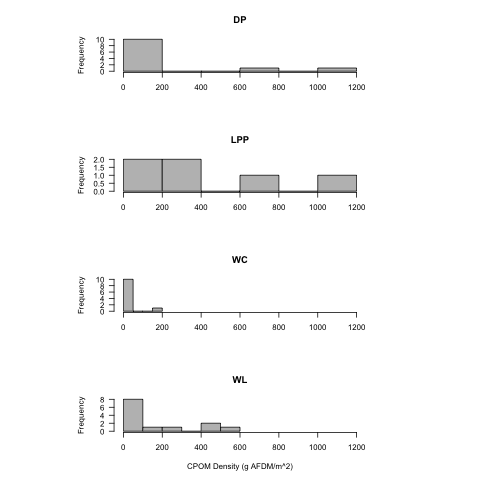
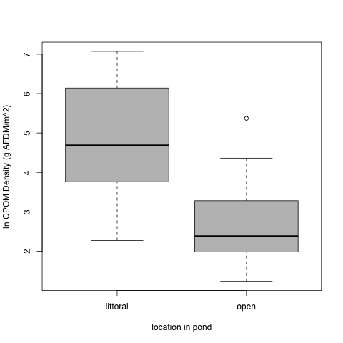
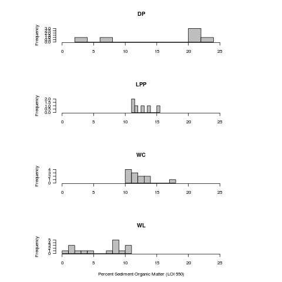

# Analysis of the CPOM Survey Data

Metadata can be found at:
  https://github.com/KennyPeanuts/pond_diversity_fcn/blob/master/lab_notebook_entries/data_analysis/code/CPOM_survey_2013_metadata.md

## Import Data

### Working Directory

    /Volumes/NO NAME/working_files/current_research/pond_diversity_fcn/lab_notebook_entries/data_analysis

### Import

    survey <- read.delim("./data/CPOM_survey_2013_calc.txt", header = T, stringsAsFactors = F)

## Data Analysis

### Research Questions

1) What is the density of CPOM in the study ponds?

2) How does the density of CPOM vary among ponds?

3) How does the density of CPOM vary within ponds?
     a. Littoral vs Open Habitats
     b. Within Littoral and Open Habitats

4) Does the density of CPOM vary with date (WL only)?

5) Is there a relationship between CPOM and percent OM in the sediments?

### Analysis

#### Density of CPOM in all samples

    summary(survey$CPOM.AFDM)

~~~~

    Min.  1st Qu.   Median     Mean  3rd Qu.     Max.     NAs 
0.001739 0.005461 0.020350 0.082150 0.092450 0.597000       12

~~~~

    par(las = 1)
    boxplot(survey$CPOM.AFDM, ylab = "CPOM Density (g AFDM/m^2)", col = 8)
    dev.copy(png, "./output/plots/CPOM_Dens_Boxplot.png")
    dev.off()

    par(las = 1)
    hist(survey$CPOM.AFDM, breaks = 10, xlab = "CPOM Density (g AFDM/m^2)", main = " ", col = 8)
    dev.copy(png, "./output/plots/CPOM_Dens_Hist.png")
    dev.off()

The data show that for all of the samples the density of CPOM is mainly under 100 mg AFDM / m^2 however there are local patches of higher CPOM with densities between 200 and 600 mg AFDM / m^2.

This is not due to differences in then location of the samples since there are 30 open and 24 littoral samples.

There is potentially a bias introduced by the lakes because most of the samples come from WL and the least from LPP

~~~~

> tapply(survey$CPOM.AFDM, survey$lake, length)
 DP LPP  WC  WL 
 12   6  12  24 
>

~~~~

#### Density of CPOM among lakes

    tapply(survey$CPOM.AFDM, survey$lake, summary)

~~~~

$DP
    Min.  1st Qu.   Median     Mean  3rd Qu.     Max. 
0.003006 0.008314 0.018960 0.088820 0.030020 0.540400 

$LPP
   Min. 1st Qu.  Median    Mean 3rd Qu.    Max. 
0.02826 0.05695 0.11170 0.20180 0.27070 0.59700 

$WC
    Min.  1st Qu.   Median     Mean  3rd Qu.     Max.     NAs 
0.001739 0.004123 0.005437 0.018230 0.020350 0.099140        1 

$WL
    Min.  1st Qu.   Median     Mean  3rd Qu.     Max.     NAs 
0.003028 0.005532 0.012520 0.074840 0.118500 0.266600       11

~~~~

    par(las = 1)
    plot(CPOM.AFDM ~ as.factor(lake), data = survey, xlab = "Pond", ylab = "CPOM Density (g AFDM / m^2)", col = 8)
    dev.copy(png, "./output/plots/CPOM_by_pond.png")
    dev.off()

    par(las = 1)
    plot(log(CPOM.AFDM) ~ as.factor(lake), data = survey, xlab = "Pond", ylab = "ln CPOM Density (g AFDM / m^2)", col = 8)
    dev.copy(png, "./output/plots/lnCPOM_by_pond.png")
    dev.off()

CPOM AFDM by pond for the 2013 survey

Natural Log transformed CPOM AFDM by pond for the 2013 survey

    par(las = 1, mfcol = c(4, 1), mar = c(5, 12, 4, 12))
    hist(survey$CPOM.AFDM[survey$lake == "DP"], breaks = 5,  xlim = c(0, 1), col = 8, main = "DP", xlab = " ")
    hist(survey$CPOM.AFDM[survey$lake == "LPP"], breaks = 5, xlim = c(0, 1), col = 8, main = "LPP", xlab = " ")
    hist(survey$CPOM.AFDM[survey$lake == "WC"], breaks = 5, xlim = c(0, 1), col = 8, main = "WC", xlab = " ")
    hist(survey$CPOM.AFDM[survey$lake == "WL"], breaks = 5, xlim = c(0, 1), col = 8, main = "WL", xlab = "CPOM Density (g AFDM/m^2)")
    dev.copy(png, "./output/plots/CPOM_by_pond_Hist.png")
    dev.off()

Frequency histograms of CPOM (g AFDM / m^2) for each pond in the 2013 survey

##### ANOVA of transformed CPOM ~ Pond

    pond.cpom.aov <- aov(log(CPOM.AFDM) ~ as.factor(lake), data = survey)
    summary(pond.cpom.aov)
    TukeyHSD(pond.cpom.aov)

###### Output

~~~~

              Df Sum Sq Mean Sq F value Pr(>F)  
as.factor(lake)  3  25.88   8.626   3.955  0.015 *
Residuals       38  82.88   2.181

Tukey multiple comparisons of means
    95% family-wise confidence level

Fit: aov(formula = log(CPOM.AFDM) ~ as.factor(lake), data = survey)

$`as.factor(lake)`
             diff        lwr        upr     p adj
LPP-DP  1.6832945 -0.3003995  3.6669885 0.1208622
WC-DP  -0.8932908 -2.5493720  0.7627904 0.4775580
WL-DP   0.1165091 -1.4717172  1.7047354 0.9972406
WC-LPP -2.5765853 -4.5901110 -0.5630597 0.0075183
WL-LPP -1.5667854 -3.5248823  0.3913115 0.1561122
WL-WC   1.0097999 -0.6155328  2.6351326 0.3537328

~~~~

The ANOVA with ln transformation shows a significant model and Tukeys HSD shows that LPP has more CPOM than WC, otherwise the CPOM density in the ponds is not significantly different.

The results of individual lakes suports the hypothesis that the density of CPOM is generally less than 0.05 - 0.1 g / m^2 with a few locations going much higher than that.

#### Density of CPOM within a lake

#### Comparison of the open and littoral habitats.

    tapply(survey$CPOM.AFDM, survey$location, summary)

~~~~

$littoral
    Min.  1st Qu.   Median     Mean  3rd Qu.     Max.     NAs 
0.004917 0.022310 0.056990 0.143300 0.227400 0.597000        2 

$open
    Min.  1st Qu.   Median     Mean  3rd Qu.     Max.     NAs 
0.001739 0.003728 0.005484 0.014840 0.013450 0.108800       10

~~~~

    par(las = 1)
    plot(CPOM.AFDM ~ as.factor(location), data = survey, col = 8, xlab = "location in pond", ylab = "CPOM Density (g AFDM/m^2)")
    dev.copy(png, "./output/plots/CPOM_by_location.png")
    dev.off()

CPOM Density (g AFDM/m^2) by location in the pond in the 2013 survey

    plot(log(CPOM.AFDM) ~ as.factor(location), data = survey, col = 8, xlab = "location in pond", ylab = "ln CPOM Density (g AFDM/m^2)")
    dev.copy(png, "./output/plots/lnCPOM_by_location.png")
    dev.off()

ln CPOM Density (g AFDM/m^2) by location in the pond in the 2013 survey

    par(las = 1, mfcol = c(2, 1), mar = c(5, 10, 5, 10))
    hist(survey$CPOM.AFDM[survey$location == "littoral"], xlim = c(0, 1), col = 8, main = "Littoral", xlab = " ")
    hist(survey$CPOM.AFDM[survey$location == "open"], xlim = c(0, 1), col = 8, main = "Open", xlab = "CPOM Density (g AFDM/m^2)")
    dev.copy(png, "./output/plots/CPOM_by_location_hist.png")
    dev.off()

Frequency histogram of CPOM Density (g AFDM/m^2) by location in the pond in the 2013 survey

##### ANOVA of transformed CPOM ~ Location

    location.cpom.aov <- lm(log(CPOM.AFDM) ~ as.factor(location), data = survey)
    anova(location.cpom.aov)

###### Output

~~~~

Analysis of Variance Table

Response: log(CPOM.AFDM)
                    Df Sum Sq Mean Sq F value    Pr(>F)    
as.factor(location)  1 44.781  44.781      28 4.658e-06 ***
Residuals           40 63.973   1.599

~~~~

The results show that there is significantly more CPOM in the littoral locations than in the open locations. However virtually all of the densities are below 100 mg AFDM / m^2

#### Relationship between CPOM and sediment %OM

##### Variation in %OM 

    summary(survey$sed.propOM)

~~~~

     Min.   1st Qu.    Median      Mean   3rd Qu.      Max.      NAs 
 0.007268  0.080530  0.106700  0.103200  0.127700  0.223000 13.000000

~~~~

   par(las = 1)
   boxplot(survey$sed.propOM * 100, col = 8, ylab = "Percent Organic Matter (LOI 550)")
   dev.copy(png, "./output/plots/percOM_boxplot.png")
   dev.off()

Percent sediment organic matter (LOI 550) in 2013 survey ponds

   par(las = 1)
   hist(survey$sed.propOM * 100, col = 8, breaks = 10)
   dev.copy(png, "./output/plots/percOM_hist.png")
   dev.off()

Frequency histogram percent sediment organic matter (LOI 550) in 2013 survey ponds

Overall the sediment organic matter ranges from between 8 and 13% but there is a cluster of samples with <5% organic matter and a cluster of samples with >20% organic matter.  It is likely that the low percent organic matter samples, are those that were very sandy.

##### Variation in percent OM by lake

    tapply(survey$sed.propOM * 100, survey$lake, summary)

~~~~

$DP
   Min. 1st Qu.  Median    Mean 3rd Qu.    Max.    NAs 
  2.363  10.800  20.710  15.830  21.230  22.300   6.000 

$LPP
   Min. 1st Qu.  Median    Mean 3rd Qu.    Max. 
  11.12   11.58   12.38   12.72   13.50   15.27 

$WC
   Min. 1st Qu.  Median    Mean 3rd Qu.    Max. 
  10.08   10.74   11.60   12.26   13.05   17.73 

$WL
   Min. 1st Qu.  Median    Mean 3rd Qu.    Max.    NAs 
 0.7268  2.4520  8.0530  6.1660  8.8560 10.1700  7.0000 

~~~~

    par(las = 1)
    plot((sed.propOM * 100) ~ as.factor(lake), data = survey, col = 8, xlab = "Pond", ylab = "Percent Sediment Organic Matter (LOI 550)")
    dev.copy(png, "./output/plots/percOM_by_lake.png")
    dev.off()

Percent sediement organic matter (LOI 550) in the different ponds in 2013 survey

    par(las = 1, mfcol = c(4, 1), mar = c(5, 10, 5, 10))
    hist(survey$sed.propOM[survey$lake == "DP"] * 100, breaks = 10, col = 8, xlim = c(0, 25), xlab = " ", main = "DP")
    hist(survey$sed.propOM[survey$lake == "LPP"] * 100, breaks = 10, col = 8, xlim = c(0, 25), xlab = " ", main = "LPP")
    hist(survey$sed.propOM[survey$lake == "WC"] * 100, breaks = 10, col = 8, xlim = c(0, 25), xlab = " ", main = "WC")
    hist(survey$sed.propOM[survey$lake == "WL"] * 100, breaks = 10, col = 8, xlim = c(0, 25), xlab = "Percent Sediment Organic Matter (LOI 550)", main = "WL")
    dev.copy(png, "./output/plots/percOM_by_lake_hist.png")
    dev.off()

Frequency histogram of percent sediement organic matter (LOI 550) in the different ponds in 2013 survey

There are differences in the way that sediment OM is distributed among the lakes.  The two catch-basin lakes (LPP and WC) have the most homogeneous sediment organic matter with virtually all samples falling between 10 and 15% sediment OM.  WL has the lowest sediment OM with virtually all samples falling below 10%.  DP shows a bimodal distribution with a 2 samples under 10% and 4 samples over 20%, so overall DP has the greatest sediment OM.

##### Variation in Perc. OM by location

    tapply(survey$sed.propOM * 100, survey$location, summary)

~~~~

$littoral
   Min. 1st Qu.  Median    Mean 3rd Qu.    Max.    NAs 
 0.7268  3.3920 10.6700  9.3270 12.8600 17.7300  7.0000 

$open
   Min. 1st Qu.  Median    Mean 3rd Qu.    Max.    NAs 
  1.536   8.188  10.390  11.030  11.900  22.300   6.000 

~~~~

    par(las = 1)
    plot(sed.propOM * 100 ~ as.factor(location), data = survey, col = 8)
    dev.copy(png, "./output/plots/percOM_by_location.png")
    dev.off()

Percent sediement organic matter (LOI 550) in open and littoral regions in 2013 survey

    par(las = 1, mfcol = c(2, 1), mar = c(5, 10, 5, 10))
    hist(survey$sed.propOM[survey$location == "littoral"] * 100, breaks = 10, xlim = c(0, 25), col = 8, main = "Littoral", xlab = " ")
    hist(survey$sed.propOM[survey$location == "open"] * 100, breaks = 10,  xlim = c(0, 25), col = 8, main = "Open", xlab = "Sediment Percent Organic Matter (LOI 550)")
    dev.copy(png, "./output/plots/percOM_by_location_hist.png")
    dev.off()

Frequency histogram of percent sediement organic matter (LOI 550) in open and littoral regions in 2013 survey

Overall there is not a big difference between the littoral and open locations the cluster of high sediment OM in DP is from the open habitat. There were samples with low percent OM from both the littoral and open habitats.

##### Relationship between CPOM and sediment percent OM

    par(las = 1)
    plot((sed.propOM * 100) ~ CPOM.AFDM, data = survey, subset = location == "littoral",  xlim = c(0, 1), ylim = c(0, 25), pch = 16, ylab = "Percent Sediment Organic Matter (LOI 550)", xlab = "CPOM Density (g AFDM/m^2)")
    points((sed.propOM * 100) ~ CPOM.AFDM, data = survey, subset = location == "open")
    legend(0.6, 25, c("littoral", "open"), pch = c(16, 1))
    dev.copy(png, "./output/plots/percOM_by_CPOM.png")
    dev.off()

_Percent sediement organic matter (LOI 550) plotted against CPOM (g AFDM/m^2) in open and littoral regions in 2013 survey_

    par(las = 1)
    plot((sed.propOM * 100) ~ log(CPOM.AFDM), data = survey, subset = location == "littoral",  xlim = c(-7, 0), ylim = c(0, 25), pch = 16, ylab = "Percent Sediment Organic Matter (LOI 550)", xlab = "ln CPOM Density (g AFDM/m^2)")
    points((sed.propOM * 100) ~ log(CPOM.AFDM), data = survey, subset = location == "open")
    legend(-3, 25, c("littoral", "open"), pch = c(16, 1))
    dev.copy(png, "./output/plots/percOM_by_lnCPOM.png")
    dev.off()

_Percent sediement organic matter (LOI 550) plotted against ln transformed CPOM (ln g AFDM/m^2) in open and littoral regions in 2013 survey_

There is no relationship between CPOM Density and sediment organic matter content.
