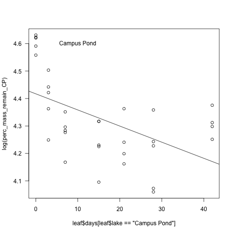

# Leaf Decomposition Experiment
## Fall 2013

### Introduction

This code is for the analysis of the loss of dry mass during decomposition during the leaf decomposition experiment.

The lab and field notes can be found in the `lab_notebook_entries` directory.

The data collection is not complete for this experiment so these data are preliminary.

### Code

#### Import Data

    leaf <- read.delim("./data/leaf_dry_mass_fall2013.txt", header = T, stringsAsFactors = F)

##### Data Structure and Metadata

~~~~

str(leaf)

'data.frame':	210 obs. of  6 variables:
 $ lake    : chr  "Campus Pond" "Campus Pond" "Campus Pond" "Campus Pond" ...
 $ sample  : int  2 8 15 33 48 9 22 35 43 67 ...
 $ date_col: chr  "22-Oct-13" "22-Oct-13" "22-Oct-13" "22-Oct-13" ...
 $ bag     : num  7.28 7.28 7.23 7.24 7.25 ...
 $ bag_leaf: num  11.5 11.8 11.6 11.8 11.8 ...
 $ days    : int  0 0 0 0 0 3 3 3 3 3 ...
 
~~~~

* lake = the name of the pond
* sample = the identifying number on the bag
* date_col = the day that the bag was removed from the pond
* bag = the mass of the empty paper bag (g)
* bag_leaf = the mass of the bag + leaves after 48+ of drying at 50 dC (g)
* days = the number of days the bag was in the lake

#### Calculate Variables

* leaf_mass = the mass of the dried leaves (g)

    leaf_mass <- leaf$bag_leaf- leaf$bag

#### Plot initial curves based on mass for each pond

All ponds together

    par(las = 1)
    plot(log(leaf_mass) ~ days, data = leaf, subset = lake == "Campus Pond")
    points(log(leaf_mass) ~ days, data = leaf, subset = lake == "Daulton Pond", col = 3)
    points(log(leaf_mass) ~ days, data = leaf, subset = lake == "Lancer Park Pond", col = 2)
    dev.copy(png, "./output/plots/All_leaf_22days.png")
    dev.off()

Campus Pond
   
    par(las = 1)
    plot(log(leaf_mass) ~ days, data = leaf, subset = lake == "Campus Pond")
    text(10, 1.5, "Campus Pond")
    dev.copy(png, "./output/plots/CP_leaf_22days.png")
    dev.off()

Daulton Pond

    par(las = 1)
    plot(log(leaf_mass) ~ days, data = leaf, subset = lake == "Daulton Pond")
    text(10, 1.5, "Daulton Pond")
    dev.copy(png, "./output/plots/DP_leaf_22days.png")
    dev.off()

Lancer Park Pond

    par(las = 1)
    plot(log(leaf_mass) ~ days, data = leaf, subset = lake == "Lancer Park Pond")
    text(10, 1.5, "Lancer Park Pond")
    dev.copy(png, "./output/plots/LPP_leaf_15days.png")
    dev.off()

 
#### Plot curves based on percent for each pond

##### Campus Pond

* initial_mass_CP = the mean of the mass of the leaf packs that were placed in the Campus Pond during deployment and then removed immediately 

    initial_mass_CP <- mean(leaf_mass[leaf$days == 0 & leaf$lake == "Campus Pond"], na.rm = T)

~~~~

> initial_mass_CP
[1] 4.47488
>

~~~~

* perc_mass_remain_CP = the percent of the leaf mass remaining relative to `initial_mass_CP`

    perc_mass_remain_CP <- (leaf_mass[leaf$lake == "Campus Pond"] / initial_mass_CP) * 100

~~~~

perc_mass_remain_CP
 [1]  95.39921 101.82396  98.59482 102.63739 101.54462  83.22681  70.03540
 [8]  78.47138  84.95647  90.32421  71.98182  64.58274  72.48686  73.40756
[15]  77.58644  74.97184  60.05748  68.73480  74.92715  68.37725  78.48926
[22]  69.45438  64.19613        NA  66.62078        NA        NA        NA
[29]        NA        NA        NA        NA        NA        NA        NA
[36]        NA        NA        NA        NA        NA        NA        NA
[43]        NA        NA        NA        NA        NA        NA        NA
[50]        NA        NA        NA        NA        NA        NA        NA
[57]        NA        NA        NA        NA        NA        NA        NA
[64]        NA        NA        NA        NA        NA        NA        NA
>

~~~~

Plot of the ln percent mass remaining by days in the pond

    plot(log(perc_mass_remain_CP) ~ leaf$days[leaf$lake == "Campus Pond"])
    abline(lm(log(perc_mass_remain_CP) ~ leaf$days[leaf$lake == "Campus Pond"]))
    text(10, 4.6, "Campus Pond")
    dev.copy(png, "./output/plots/CP_perc_loss.png")
    dev.off()

###### Analysis of decay constant k

According to Benfield, Chapter 30 in Methods in Stream Ecology, pg 716, the slope of ln of the percent remaining by days should be linear and represent k.  

    summary(lm(log(perc_mass_remain_CP) ~ leaf$days[leaf$lake == "Campus Pond"]))

~~~~

>     summary(lm(log(perc_mass_remain_CP) ~ leaf$days[leaf$lake == "Campus Pond"]))

Call:
lm(formula = log(perc_mass_remain_CP) ~ leaf$days[leaf$lake == 
    "Campus Pond"])

Residuals:
      Min        1Q    Median        3Q       Max 
-0.213327 -0.080852 -0.003174  0.070825  0.194654 

Coefficients:
                                       Estimate Std. Error t value Pr(>|t|)    
(Intercept)                            4.487757   0.034834 128.832  < 2e-16 ***
leaf$days[leaf$lake == "Campus Pond"] -0.015212   0.003027  -5.026 4.95e-05 ***
---

Residual standard error: 0.1116 on 22 degrees of freedom
  (46 observations deleted due to missingness)
Multiple R-squared: 0.5345,	Adjusted R-squared: 0.5133 
F-statistic: 25.26 on 1 and 22 DF,  p-value: 4.948e-05 

>

~~~~

In this case the ln percent remaining still shows a curveilinear relationship.
