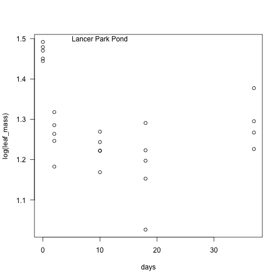

# Leaf Decomposition Experiment
## Fall 2013

### Introduction

This code is for the analysis of the loss of dry mass during decomposition during the leaf decomposition experiment.

The lab and field notes can be found in the `lab_notebook_entries` directory.

The data collection is not complete for this experiment so these data are preliminary.

### Code

#### Import Data

    leaf <- read.delim("./data/leaf_dry_mass_fall2013.txt", header = T, stringsAsFactors = F)

##### Data Structure and Metadata

~~~~

str(leaf)

'data.frame':	210 obs. of  6 variables:
 $ lake    : chr  "Campus Pond" "Campus Pond" "Campus Pond" "Campus Pond" ...
 $ sample  : int  2 8 15 33 48 9 22 35 43 67 ...
 $ date_col: chr  "22-Oct-13" "22-Oct-13" "22-Oct-13" "22-Oct-13" ...
 $ bag     : num  7.28 7.28 7.23 7.24 7.25 ...
 $ bag_leaf: num  11.5 11.8 11.6 11.8 11.8 ...
 $ days    : int  0 0 0 0 0 3 3 3 3 3 ...
 
~~~~

* lake = the name of the pond
* sample = the identifying number on the bag
* date_col = the day that the bag was removed from the pond
* bag = the mass of the empty paper bag (g)
* bag_leaf = the mass of the bag + leaves after 48+ of drying at 50 dC (g)
* days = the number of days the bag was in the lake

#### Calculate Variables

* leaf_mass = the mass of the dried leaves (g)

    leaf_mass <- leaf$bag_leaf- leaf$bag

#### Plot initial curves based on mass for each pond

All ponds together

    par(las = 1)
    plot(log(leaf_mass) ~ days, data = leaf, subset = lake == "Campus Pond")
    points(log(leaf_mass) ~ days, data = leaf, subset = lake == "Daulton Pond", col = 3)
    points(log(leaf_mass) ~ days, data = leaf, subset = lake == "Lancer Park Pond", col = 2)
    dev.copy(png, "./output/plots/All_ponds_leaf.png")
    dev.off()

Campus Pond
   
    par(las = 1)
    plot(log(leaf_mass) ~ days, data = leaf, subset = lake == "Campus Pond")
    text(10, 1.5, "Campus Pond")
    dev.copy(png, "./output/plots/CP_leaf.png")
    dev.off()

Daulton Pond

    par(las = 1)
    plot(log(leaf_mass) ~ days, data = leaf, subset = lake == "Daulton Pond")
    text(10, 1.5, "Daulton Pond")
    dev.copy(png, "./output/plots/DP_leaf.png")
    dev.off()

Lancer Park Pond

    par(las = 1)
    plot(log(leaf_mass) ~ days, data = leaf, subset = lake == "Lancer Park Pond")
    text(10, 1.5, "Lancer Park Pond")
    dev.copy(png, "./output/plots/LPP_leaf.png")
    dev.off()

 
#### Plot curves based on percent for each pond

##### Campus Pond

* initial_mass_CP = the mean of the mass of the leaf packs that were placed in the Campus Pond during deployment and then removed immediately 

    initial_mass_CP <- mean(leaf_mass[leaf$days == 0 & leaf$lake == "Campus Pond"], na.rm = T)

~~~~

> initial_mass_CP
[1] 4.47488
>

~~~~

* perc_mass_remain_CP = the percent of the leaf mass remaining relative to `initial_mass_CP`

    perc_mass_remain_CP <- (leaf_mass[leaf$lake == "Campus Pond"] / initial_mass_CP) * 100

Plot of the ln percent mass remaining by days in the pond

    plot(log(perc_mass_remain_CP) ~ leaf$days[leaf$lake == "Campus Pond"])
    abline(lm(log(perc_mass_remain_CP) ~ leaf$days[leaf$lake == "Campus Pond"]))
    text(10, 4.6, "Campus Pond")
    dev.copy(png, "./output/plots/CP_perc_loss.png")
    dev.off()

###### Analysis of decay constant k

According to Benfield, Chapter 30 in Methods in Stream Ecology, pg 716, the slope of ln of the percent remaining by days should be linear and represent k.  

    summary(lm(log(perc_mass_remain_CP) ~ leaf$days[leaf$lake == "Campus Pond"]))

~~~~

>     summary(lm(log(perc_mass_remain_CP) ~ leaf$days[leaf$lake == "Campus Pond"]))

Call:
lm(formula = log(perc_mass_remain_CP) ~ leaf$days[leaf$lake == 
    "Campus Pond"])

Residuals:
     Min       1Q   Median       3Q      Max 
-0.23363 -0.09867 -0.01241  0.10574  0.21416 

Coefficients:
                                       Estimate Std. Error t value Pr(>|t|)    
(Intercept)                            4.417037   0.035825 123.295  < 2e-16 ***
leaf$days[leaf$lake == "Campus Pond"] -0.005874   0.001730  -3.396  0.00189 ** 
---

Residual standard error: 0.1346 on 31 degrees of freedom
  (37 observations deleted due to missingness)
Multiple R-squared: 0.2711,	Adjusted R-squared: 0.2476 
F-statistic: 11.53 on 1 and 31 DF,  p-value: 0.001892 

> 

~~~~

##### Daulton Pond

* initial_mass_CP = the mean of the mass of the leaf packs that were placed in the Daulton Pond during deployment and then removed immediately 

    initial_mass_DP <- mean(leaf_mass[leaf$days == 0 & leaf$lake == "Daulton Pond"], na.rm = T)

~~~~

> initial_mass_DP
[1] 4.49732
> 

~~~~

* perc_mass_remain_DP = the percent of the leaf mass remaining relative to `initial_mass_DP`

    perc_mass_remain_DP <- (leaf_mass[leaf$lake == "Daulton Pond"] / initial_mass_DP) * 100

Plot of the ln percent mass remaining by days in the pond

    plot(log(perc_mass_remain_DP) ~ leaf$days[leaf$lake == "Daulton Pond"])
    abline(lm(log(perc_mass_remain_DP) ~ leaf$days[leaf$lake == "Daulton Pond"]))
    text(10, 4.6, "Daulton Pond")
    dev.copy(png, "./output/plots/DP_perc_loss.png")
    dev.off()

##### Lancer Park Pond

* initial_mass_CP = the mean of the mass of the leaf packs that were placed in the Daulton Pond during deployment and then removed immediately 

    initial_mass_LPP <- mean(leaf_mass[leaf$days == 0 & leaf$lake == "Lancer Park Pond"], na.rm = T)

~~~~

> initial_mass_LPP
[1] 4.33764
> 

~~~~

* perc_mass_remain_LPP = the percent of the leaf mass remaining relative to `initial_mass_LPP`

    perc_mass_remain_LPP <- (leaf_mass[leaf$lake == "Lancer Park Pond"] / initial_mass_LPP) * 100

Plot of the ln percent mass remaining by days in the pond

    plot(log(perc_mass_remain_LPP) ~ leaf$days[leaf$lake == "Lancer Park Pond"])
    abline(lm(log(perc_mass_remain_LPP) ~ leaf$days[leaf$lake == "Lancer Park Pond"]))
    text(10, 4.6, "Lancer Park Pond")
    dev.copy(png, "./output/plots/LPP_perc_loss.png")
    dev.off()

