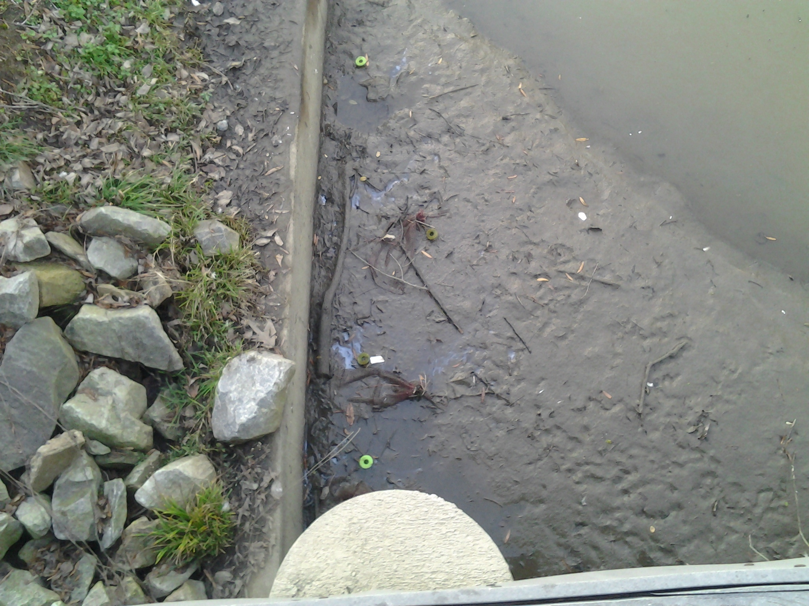
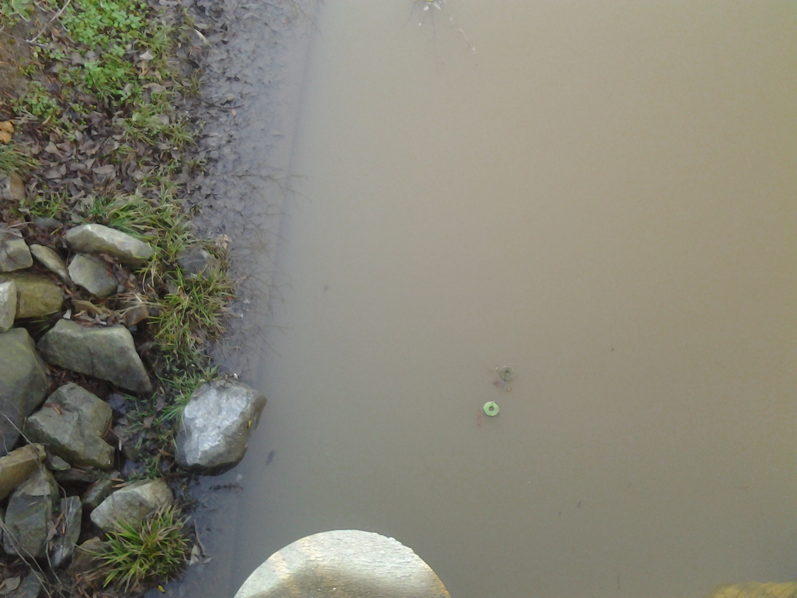

# Field Notes for Campus Pond Leaf Decomposition

## Date

These notes are for observations made in CP between 20 Dec 2013 and 4 Jan 2014

## Author

KF

## Location

Campus Pond, Longwood University Campus

## Purpose

The notes document observations on changes in the water level of the pond.

## Field observations

When I (KF) harvested the bags on 18 Dec 2013 the water level of the pond was at the top of the concrete wall around the edge of the pond as it has been since the bags were deployed.

When I observed the pond on 20 Dec 2013, the water in the pond had mostly drained leaving only the center channel filled with water.  This draining left all of the bags out of the water (Fig. 1)

Figure 1. Photo of the litter bags in Campus Pond taken from the deck looking away from campus on 20 Dec 2013 after the pond had drained.

I inquired with a campus grounds person about the condition of the pond and was told that the previous "full" state of the pond was due to debris blocking the drain pipe.  The recent rain had apparently dislodged the debris and the pond is now draining as it is intended.  Thus the pond will continue drain after each rain.

When I was next able to observe the pond on 29 Dec 2013, the pond had refilled (Fig. 2).  I do not know on what date the pond actually refilled.  The pond has remained full since then although the water level has fluctuated.  All of the bags are submerged.

Figure 2. Photo of litter bags in Campus pond after the pond refilled from the exact same location as Figure 1.  Photo taken on 29 Dec. 2013.

