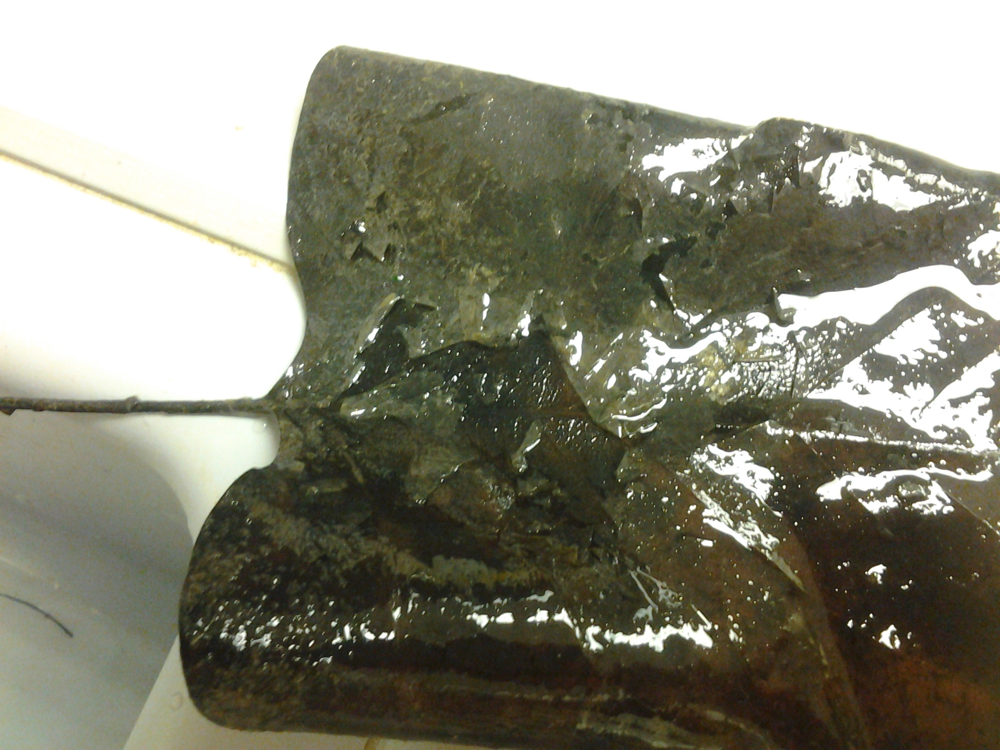

# Lab Notes for Pond Leaf Decomposition Bag Processing

## Date

18 Dec 2013

## Samples

Bags 2, 4, 37, 52, and 66 from CP harvested on 18 Dec 2013

## Purpose

I am washing the sediment from the leaves and placing the leaves into the paper bags to dry.  The sediment and associated organisms are preserved in EtOH.

## Lab observations and data

### Bag Initial masses

~~~~

Sample Number    Bag Mass (g)
--------------  -------------
2                 7.1835
4                 7.1204
37                7.2097
52                7.1957
66                7.1438

~~~~~

My bag weights seem slightly lower than what has been recorded in the past.  I noticed that the balance was taking 30 s to 1 m to settle so it is possible that previous entries were taken earlier.

### Leaf washing

Overall I found very few animals associated with the leaves. Mostly I found chironominae that appeared to be Chironomus

In Bag 2 the leaves were partially covered in fine grey sediment.  Some of the leaves showed a clear biofilm accumulation (Fig. 1)

