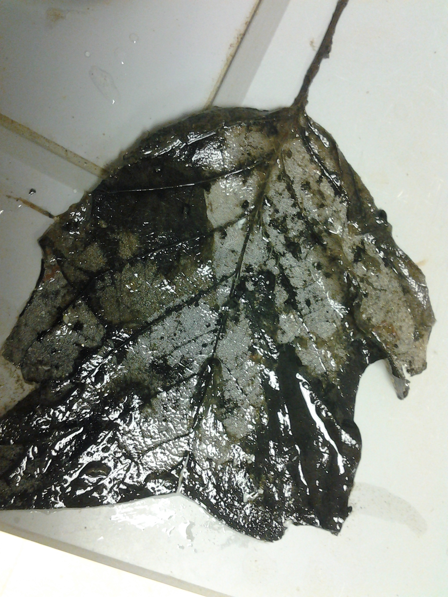
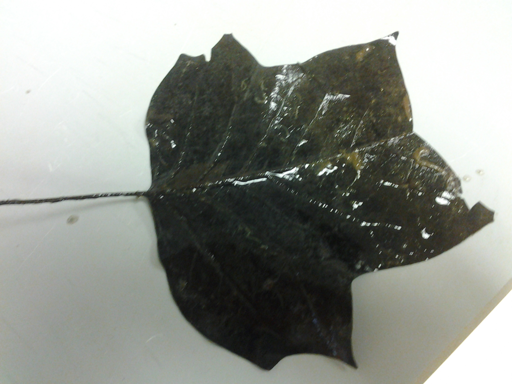
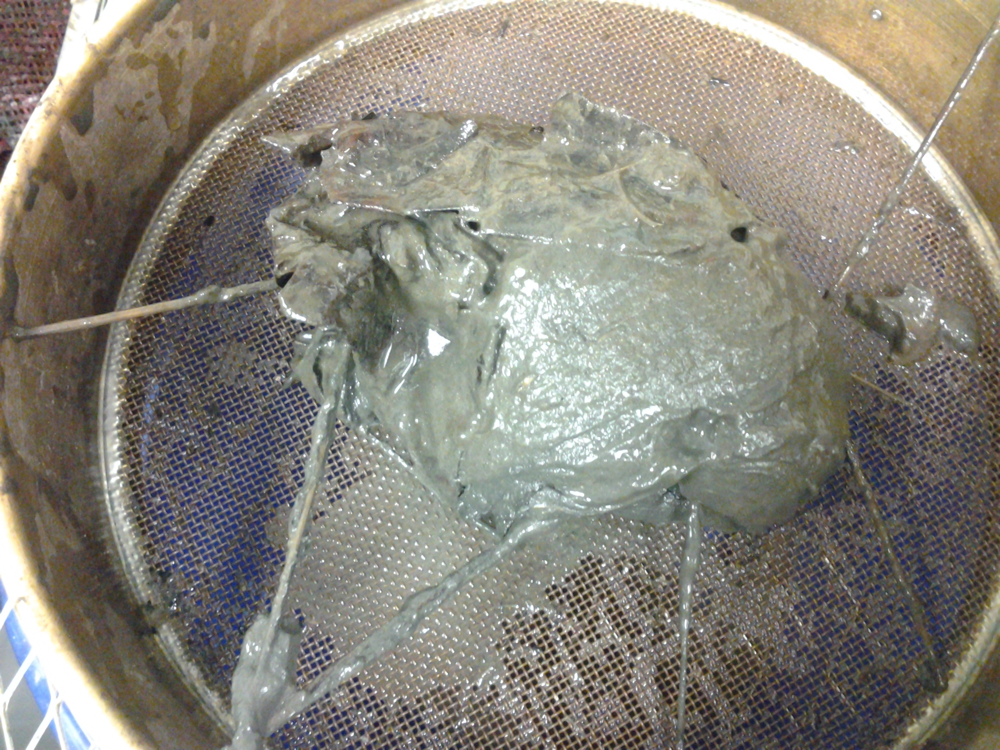
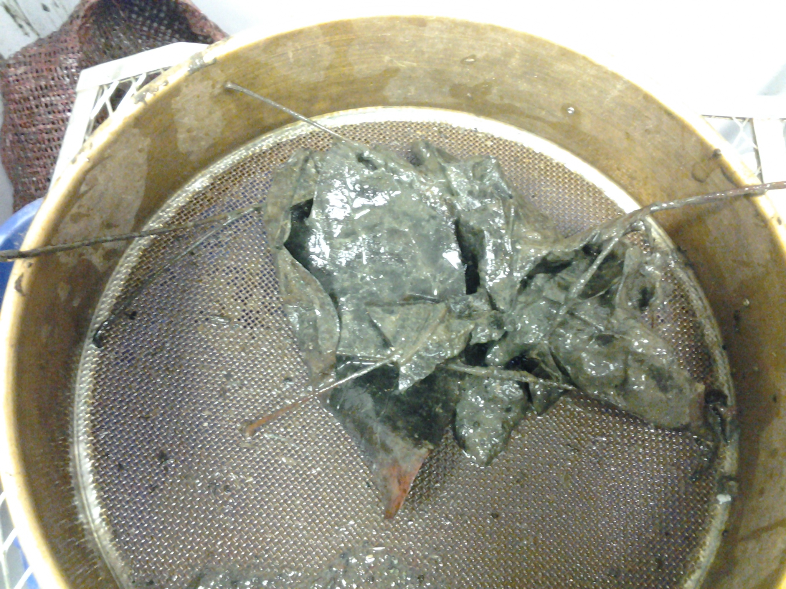

# Lab Notes for Pond Leaf Decomposition Bag Processing

## Date

18 Dec 2013

## Samples

Bags 2, 4, 37, 52, and 66 from CP harvested on 18 Dec 2013

## Purpose

I am washing the sediment from the leaves and placing the leaves into the paper bags to dry.  The sediment and associated organisms are preserved in EtOH.

## Lab observations and data

### Bag Initial masses

~~~~

Sample Number    Bag Mass (g)
--------------  -------------
2                 7.1835
4                 7.1204
37                7.2097
52                7.1957
66                7.1438

~~~~~

My bag weights seem slightly lower than what has been recorded in the past.  I noticed that the balance was taking 30 s to 1 m to settle so it is possible that previous entries were taken earlier.

### Leaf washing

Overall I found very few animals associated with the leaves. Mostly I found chironominae that appeared to be Chironomus

The leaves were partially covered in fine grey sediment.  Some of the leaves showed a clear biofilm accumulation (Fig. 1). Other leaves were partially skeletonized (Fig. 2) but others were practically intact (Fig. 3). 

This pattern was clear throughout all of the bags.  Some of the leaves showed lots of obvious decomposition but others were mainly intact even within the same bag.

The amount of sediment in the leaves varied.  Bag 57 was embedded in the mud in the portion of the pond under the decking and there was more mud surrounding the leaves in the bag (Fig. 4).  In contrast the other bags not under the decking had less mud accumulation (e.g., bag 66, Fig. 5).  Despite the differences in mud accumulation there were no obvious difference in the condition of the leaves.  All bags had variation in the apparent decomposition of the leaves. 

Figure 1. Leaf from CP bag 2 on 18 Dec 2013 showing biofilm accumulation.

Figure 2. Leaf from CP bag 2 on 18 Dec 2013 showing decomposition.

Figure 3. Leaf from CP bag 4 on 18 Dec 2013 showing lack of obvious decomposition.

Figure 4. Leaf from CP bag 57 on 18 Dec 2013 showing sediment accumulation.

Figure 5. Leaf from CP bag 66 on 18 Dec 2013 showing sediment accumulation.

